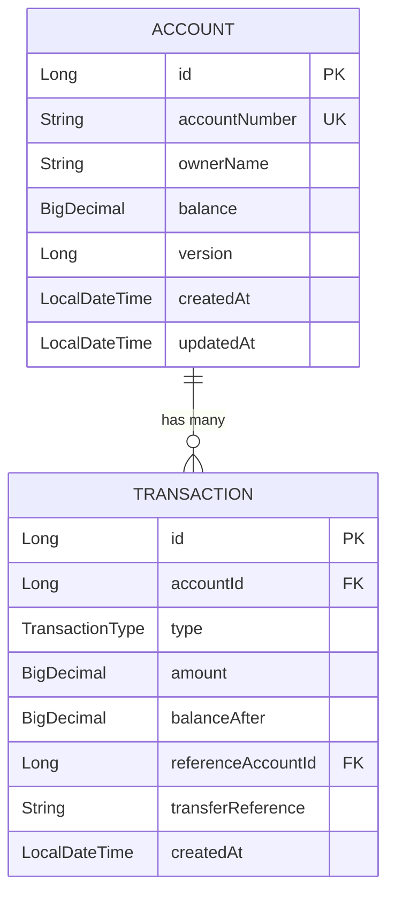
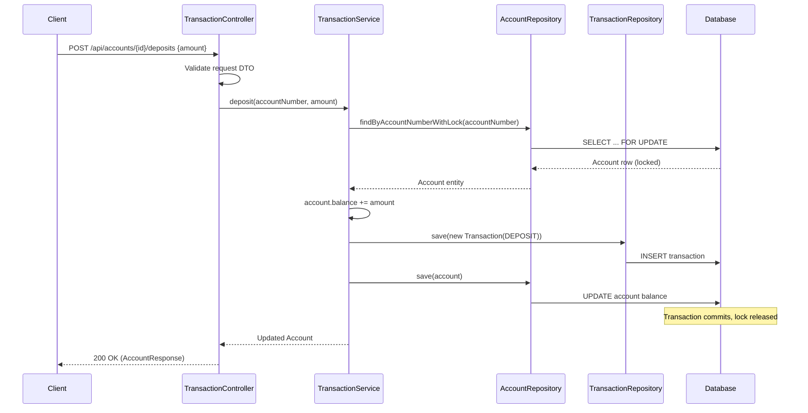
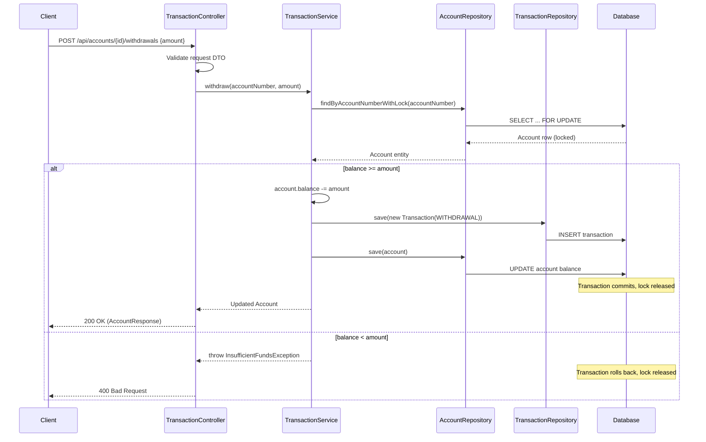
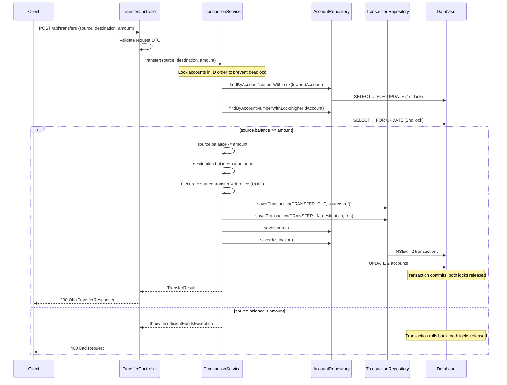

# Banking System API — Technical Design Document

**Version:** 1.0
**Date:** 2026-02-18
**Author:** Senior Software Architect
**PRD Reference:** docs/account-management-prd.md
**Status:** Draft

---

## 1. Technology Stack

Derived from `CLAUDE.md` and `pom.xml`:

| Layer | Technology | Version | Rationale |
|-------|-----------|---------|-----------|
| Language | Java | 25 | Latest LTS features, records, pattern matching |
| Framework | Spring Boot | 4.0.2 | Convention-over-configuration, mature ecosystem for REST APIs |
| Database | H2 | (managed by Spring Boot) | Embedded relational DB — ideal for V1 with zero infrastructure overhead. Migrating to PostgreSQL later requires only driver + config changes thanks to JPA abstraction |
| ORM | Spring Data JPA / Hibernate | (managed by Spring Boot) | Reduces boilerplate for CRUD, provides built-in pessimistic locking support (needed for BR-007, BR-008) |
| Build | Maven | (wrapper included) | Consistent builds via `mvnw` |
| Utilities | Lombok | (managed by Spring Boot) | Reduces boilerplate for entities and DTOs |
| Testing | Spring Boot Test, JUnit 5 | (managed by Spring Boot) | Standard test stack, integrates with H2 for integration tests |

### Dependencies to Add

The current `pom.xml` is missing key starters. The following must be added:

| Dependency | Purpose |
|-----------|---------|
| `spring-boot-starter-web` | REST controller support, Jackson JSON, embedded Tomcat |
| `spring-boot-starter-data-jpa` | JPA/Hibernate, Spring Data repositories |
| `spring-boot-starter-validation` | Bean Validation (Jakarta Validation) for request DTOs (NFR-004, NFR-008–NFR-010) |

**Why JPA over plain JDBC?** JPA gives us entity lifecycle management, dirty checking, and — critically — `@Lock(PESSIMISTIC_WRITE)` on repository methods for concurrency control (BR-007). The trade-off is slight overhead, but for this domain the safety guarantees outweigh the cost.

---

## 2. Project Structure

```
src/main/java/com/thanaphon/banking_system_with_ai/
├── BankingSystemWithAiApplication.java          # Entry point
├── controller/
│   ├── AccountController.java                   # Account CRUD endpoints
│   ├── TransactionController.java               # Deposit, withdrawal, transaction history
│   └── TransferController.java                  # Transfer endpoint
├── dto/
│   ├── request/
│   │   ├── CreateAccountRequest.java            # FR-001
│   │   ├── DepositRequest.java                  # FR-004
│   │   ├── WithdrawRequest.java                 # FR-005
│   │   └── TransferRequest.java                 # FR-006
│   └── response/
│       ├── AccountResponse.java                 # FR-001, FR-002, FR-003
│       ├── TransactionResponse.java             # FR-007
│       ├── TransferResponse.java                # FR-006
│       └── ErrorResponse.java                   # NFR-006
├── entity/
│   ├── Account.java                             # Account domain entity
│   └── Transaction.java                         # Transaction domain entity
├── enums/
│   └── TransactionType.java                     # DEPOSIT, WITHDRAWAL, TRANSFER_IN, TRANSFER_OUT
├── exception/
│   ├── AccountNotFoundException.java            # Maps to HTTP 404
│   ├── InsufficientFundsException.java          # Maps to HTTP 400 (BR-003)
│   ├── InvalidAmountException.java              # Maps to HTTP 400 (NFR-010)
│   ├── SameAccountTransferException.java        # Maps to HTTP 400 (FR-006)
│   └── GlobalExceptionHandler.java              # @RestControllerAdvice
├── repository/
│   ├── AccountRepository.java                   # JPA repository for Account
│   └── TransactionRepository.java               # JPA repository for Transaction
└── service/
    ├── AccountService.java                      # Account lifecycle operations
    └── TransactionService.java                  # Deposits, withdrawals, transfers
```

### Rationale

**Why separate TransferController from TransactionController?** Transfers operate across two accounts and have a distinct URI (`/api/transfers`) per the PRD endpoint table. Keeping them separate follows the Single Responsibility Principle and maps cleanly to the PRD's feature grouping.

**Why a DTO layer separate from entities?** Prevents JPA entity internals (IDs, audit fields, locking versions) from leaking into the API contract. Also allows request validation annotations to live on DTOs without polluting the domain model.

---

## 3. Entity / Domain Model Design

### Account Entity

| Field | Type | Constraints | PRD Reference |
|-------|------|-------------|---------------|
| `id` | `Long` | Primary key, auto-generated | Internal |
| `accountNumber` | `String` | Unique, non-null, indexed | FR-001, NFR-005, NFR-011 |
| `ownerName` | `String` | Non-null, max 100 chars | FR-001, NFR-009 |
| `balance` | `BigDecimal` | Non-null, scale 2, >= 0 | BR-001, BR-003 |
| `version` | `Long` | Optimistic locking field | BR-007, BR-008 |
| `createdAt` | `LocalDateTime` | Non-null, set on creation | FR-001 |
| `updatedAt` | `LocalDateTime` | Updated on every modification | Audit |

**Account number generation (NFR-005):** Use `UUID.randomUUID()` truncated/formatted to a 10-character alphanumeric string. This satisfies the non-sequential, non-guessable requirement without external dependencies.

**Why `BigDecimal` for balance? (BR-001, NFR-008):** Floating-point types (`float`, `double`) have binary representation errors that produce incorrect results for decimal arithmetic (e.g., `0.1 + 0.2 ≠ 0.3`). `BigDecimal` with explicit scale of 2 guarantees cent-precise arithmetic with no rounding surprises.

### Transaction Entity

| Field | Type | Constraints | PRD Reference |
|-------|------|-------------|---------------|
| `id` | `Long` | Primary key, auto-generated | FR-007 |
| `accountId` | `Long` | Foreign key → Account, non-null, indexed | BR-011 |
| `type` | `TransactionType` (enum) | Non-null | FR-004–FR-007 |
| `amount` | `BigDecimal` | Non-null, > 0, scale 2 | BR-001, BR-011 |
| `balanceAfter` | `BigDecimal` | Non-null, scale 2 | FR-007, BR-011 |
| `referenceAccountId` | `Long` | Nullable — set only for transfers | FR-006, FR-007 |
| `transferReference` | `String` | Nullable — shared UUID linking TRANSFER_IN/OUT pair | FR-006 |
| `createdAt` | `LocalDateTime` | Non-null, set on creation | BR-011 |

**Why `transferReference`? (FR-006):** The PRD requires TRANSFER_OUT and TRANSFER_IN records "linked by a common reference." A shared UUID enables querying both sides of a transfer for auditing and troubleshooting.

**Transaction records are immutable (BR-009, BR-010):** No `updatedAt` field. The entity provides no setter methods for any field after construction. Repository exposes only `save()` and read methods — no `delete` or `update` operations.

### TransactionType Enum

```
DEPOSIT, WITHDRAWAL, TRANSFER_IN, TRANSFER_OUT
```

### Entity Relationship Diagram



---

## 4. Database Schema

### Table: `accounts`

| Column | Type | Constraints |
|--------|------|-------------|
| `id` | `BIGINT` | PRIMARY KEY, AUTO_INCREMENT |
| `account_number` | `VARCHAR(20)` | UNIQUE, NOT NULL |
| `owner_name` | `VARCHAR(100)` | NOT NULL |
| `balance` | `DECIMAL(15,2)` | NOT NULL, CHECK (balance >= 0) |
| `version` | `BIGINT` | NOT NULL, DEFAULT 0 |
| `created_at` | `TIMESTAMP` | NOT NULL |
| `updated_at` | `TIMESTAMP` | NOT NULL |

**Indexes:**
- `idx_accounts_account_number` on `account_number` (unique) — lookup by account number (FR-002)

**Why `DECIMAL(15,2)`?** Supports values up to $9,999,999,999,999.99. This exceeds the $1,000,000 max transaction (BR-004) while allowing account balances to accumulate over time. Scale of 2 enforces cent precision at the database level.

**Why CHECK constraint on balance?** Defense-in-depth for BR-003. Even if application logic has a bug, the database itself rejects negative balances.

### Table: `transactions`

| Column | Type | Constraints |
|--------|------|-------------|
| `id` | `BIGINT` | PRIMARY KEY, AUTO_INCREMENT |
| `account_id` | `BIGINT` | NOT NULL, FOREIGN KEY → accounts(id) |
| `type` | `VARCHAR(20)` | NOT NULL |
| `amount` | `DECIMAL(15,2)` | NOT NULL, CHECK (amount > 0) |
| `balance_after` | `DECIMAL(15,2)` | NOT NULL |
| `reference_account_id` | `BIGINT` | NULLABLE |
| `transfer_reference` | `VARCHAR(36)` | NULLABLE |
| `created_at` | `TIMESTAMP` | NOT NULL |

**Indexes:**
- `idx_transactions_account_id_created_at` on `(account_id, created_at DESC)` — optimizes transaction history queries ordered by date (FR-007, NFR-003)
- `idx_transactions_transfer_reference` on `transfer_reference` — enables lookup of transfer pairs for audit

**Why composite index on `(account_id, created_at DESC)`? (NFR-003):** The PRD requires efficient history queries for up to 10,000 transactions per account. A composite index allows the database to satisfy `WHERE account_id = ? ORDER BY created_at DESC` as an index-only scan without sorting.

---

## 5. API Contract Details

### 5.1 Create Account (FR-001)

**Request:**
```
POST /api/accounts
Content-Type: application/json
```
```json
{
  "ownerName": "John Doe",
  "initialDeposit": 500.00
}
```

**Success Response (201 Created):**
```json
{
  "accountNumber": "A3K9X7M2P1",
  "ownerName": "John Doe",
  "balance": 500.00,
  "createdAt": "2026-02-18T10:30:00"
}
```

**Error Response (400 Bad Request):**
```json
{
  "error": "VALIDATION_ERROR",
  "message": "Minimum opening deposit is $100.00",
  "timestamp": "2026-02-18T10:30:00"
}
```

### 5.2 Get Account (FR-002)

**Request:**
```
GET /api/accounts/A3K9X7M2P1
```

**Success Response (200 OK):**
```json
{
  "accountNumber": "A3K9X7M2P1",
  "ownerName": "John Doe",
  "balance": 500.00,
  "createdAt": "2026-02-18T10:30:00"
}
```

**Error Response (404 Not Found):**
```json
{
  "error": "ACCOUNT_NOT_FOUND",
  "message": "Account not found",
  "timestamp": "2026-02-18T10:30:00"
}
```

### 5.3 List All Accounts (FR-003)

**Request:**
```
GET /api/accounts
```

**Success Response (200 OK):**
```json
[
  {
    "accountNumber": "A3K9X7M2P1",
    "ownerName": "John Doe",
    "balance": 500.00,
    "createdAt": "2026-02-18T10:30:00"
  }
]
```

### 5.4 Deposit (FR-004)

**Request:**
```
POST /api/accounts/A3K9X7M2P1/deposits
Content-Type: application/json
```
```json
{
  "amount": 250.00
}
```

**Success Response (200 OK):**
```json
{
  "accountNumber": "A3K9X7M2P1",
  "ownerName": "John Doe",
  "balance": 750.00,
  "createdAt": "2026-02-18T10:30:00"
}
```

### 5.5 Withdrawal (FR-005)

**Request:**
```
POST /api/accounts/A3K9X7M2P1/withdrawals
Content-Type: application/json
```
```json
{
  "amount": 100.00
}
```

**Success Response (200 OK):**
```json
{
  "accountNumber": "A3K9X7M2P1",
  "ownerName": "John Doe",
  "balance": 650.00,
  "createdAt": "2026-02-18T10:30:00"
}
```

**Error Response (400 Bad Request — insufficient funds):**
```json
{
  "error": "INSUFFICIENT_FUNDS",
  "message": "Insufficient funds",
  "timestamp": "2026-02-18T10:30:00"
}
```

### 5.6 Transfer (FR-006)

**Request:**
```
POST /api/transfers
Content-Type: application/json
```
```json
{
  "sourceAccountId": "A3K9X7M2P1",
  "destinationAccountId": "B7L2Y8N4Q6",
  "amount": 200.00
}
```

**Success Response (200 OK):**
```json
{
  "transferReference": "f47ac10b-58cc-4372-a567-0e02b2c3d479",
  "sourceAccountNumber": "A3K9X7M2P1",
  "destinationAccountNumber": "B7L2Y8N4Q6",
  "amount": 200.00,
  "sourceBalanceAfter": 450.00,
  "destinationBalanceAfter": 700.00,
  "timestamp": "2026-02-18T10:35:00"
}
```

### 5.7 Transaction History (FR-007)

**Request:**
```
GET /api/accounts/A3K9X7M2P1/transactions
```

**Success Response (200 OK):**
```json
[
  {
    "id": 3,
    "type": "TRANSFER_OUT",
    "amount": 200.00,
    "balanceAfter": 450.00,
    "referenceAccountNumber": "B7L2Y8N4Q6",
    "timestamp": "2026-02-18T10:35:00"
  },
  {
    "id": 2,
    "type": "DEPOSIT",
    "amount": 250.00,
    "balanceAfter": 750.00,
    "referenceAccountNumber": null,
    "timestamp": "2026-02-18T10:32:00"
  },
  {
    "id": 1,
    "type": "DEPOSIT",
    "amount": 500.00,
    "balanceAfter": 500.00,
    "referenceAccountNumber": null,
    "timestamp": "2026-02-18T10:30:00"
  }
]
```

### Error Response Contract (NFR-006)

All error responses follow a consistent structure:

```json
{
  "error": "ERROR_CODE",
  "message": "Human-readable description",
  "timestamp": "2026-02-18T10:30:00"
}
```

| HTTP Status | Error Code | When |
|-------------|-----------|------|
| 400 | `VALIDATION_ERROR` | Input validation failures (NFR-008–NFR-010) |
| 400 | `INSUFFICIENT_FUNDS` | Balance < withdrawal/transfer amount (BR-003) |
| 400 | `SAME_ACCOUNT_TRANSFER` | Source == destination (FR-006) |
| 404 | `ACCOUNT_NOT_FOUND` | Account does not exist |
| 500 | `INTERNAL_ERROR` | Unexpected server errors (no internal details exposed) |

---

## 6. Service Layer Design

### AccountService

**Responsibility:** Account lifecycle — creation, retrieval, and listing.

| Operation | Description | PRD Ref |
|-----------|-------------|---------|
| Create account | Validate input, generate account number, persist with initial balance, create initial DEPOSIT transaction record | FR-001, BR-002 |
| Get account by number | Lookup and return, or throw AccountNotFoundException | FR-002 |
| List all accounts | Return all accounts | FR-003 |

**Design decision:** The initial deposit during account creation is recorded as a DEPOSIT transaction. This ensures the audit trail is complete from the very first cent (BR-009).

### TransactionService

**Responsibility:** All balance-changing operations — deposits, withdrawals, transfers.

| Operation | Description | PRD Ref |
|-----------|-------------|---------|
| Deposit | Validate amount, load account with lock, increase balance, record DEPOSIT transaction | FR-004, BR-001, BR-009 |
| Withdraw | Validate amount, load account with lock, check sufficient funds, decrease balance, record WITHDRAWAL transaction | FR-005, BR-003, BR-009 |
| Transfer | Validate amount + different accounts, load both accounts with locks (ordered by ID), check sufficient funds on source, debit source, credit destination, record TRANSFER_OUT + TRANSFER_IN with shared reference | FR-006, BR-005, BR-006 |
| Get history | Load transactions by account, ordered by creation date descending | FR-007 |

**Why does TransactionService handle deposits/withdrawals instead of AccountService?** Deposits, withdrawals, and transfers all follow the same pattern: validate → lock → mutate balance → record transaction. Centralizing this in one service ensures consistent locking and audit behavior (BR-007–BR-011).

---

## 7. Exception Handling Strategy

### Exception Hierarchy

```
RuntimeException
├── AccountNotFoundException          → 404
├── InsufficientFundsException        → 400
├── InvalidAmountException            → 400
└── SameAccountTransferException      → 400
```

**All exceptions extend `RuntimeException`** — they are unchecked because they represent business rule violations that cannot be "recovered from" within the call chain. They bubble up to the global handler.

### Global Exception Handler

A single `@RestControllerAdvice` class (`GlobalExceptionHandler`) catches all exceptions and maps them to the standard `ErrorResponse` format.

**Why a global handler instead of per-controller try-catch? (NFR-006):**
- Guarantees every error follows the same response structure
- Prevents internal details (stack traces, class names) from leaking
- Single place to maintain error mapping — no risk of inconsistency across controllers

**MethodArgumentNotValidException** (thrown by Jakarta Validation) is also handled here, mapped to `VALIDATION_ERROR` with a message describing the first validation failure.

---

## 8. Validation Strategy

Validation happens at **two layers** — defense-in-depth:

### Layer 1: Request DTOs (Input boundary — NFR-004, NFR-008–NFR-010)

Jakarta Bean Validation annotations on request DTOs:

| DTO | Field | Validation | PRD Ref |
|-----|-------|-----------|---------|
| `CreateAccountRequest` | `ownerName` | `@NotBlank`, `@Size(max=100)` | NFR-009 |
| `CreateAccountRequest` | `initialDeposit` | `@NotNull`, `@DecimalMin("100.00")`, `@Digits(integer=13, fraction=2)` | BR-002, NFR-010 |
| `DepositRequest` | `amount` | `@NotNull`, `@DecimalMin(value="0.01")`, `@Digits(integer=13, fraction=2)` | NFR-010, BR-004 |
| `WithdrawRequest` | `amount` | Same as DepositRequest | NFR-010 |
| `TransferRequest` | `amount` | Same as DepositRequest | NFR-010 |
| `TransferRequest` | `sourceAccountId` | `@NotBlank` | FR-006 |
| `TransferRequest` | `destinationAccountId` | `@NotBlank` | FR-006 |

**Maximum transaction amount (BR-004):** Enforced via `@DecimalMax("1000000.00")` on all amount fields.

### Layer 2: Service Logic (Business rules)

- Sufficient balance check before withdrawal/transfer (BR-003)
- Source ≠ destination for transfers (FR-006)
- Account existence verification (FR-002)

**Why two layers?** DTO validation catches malformed input early (fast-fail, clear error messages). Service validation catches rules that require database state (e.g., balance checks). Neither layer alone is sufficient.

---

## 9. Transaction Management Approach

### Concurrency Control (BR-007, BR-008, NFR-002)

**Strategy: Pessimistic locking with ordered lock acquisition.**

For single-account operations (deposit, withdrawal):
- Use `@Lock(LockModeType.PESSIMISTIC_WRITE)` on the repository query that loads the account
- This acquires a database row-level lock (`SELECT ... FOR UPDATE`) that blocks concurrent modifications

For transfers (two accounts):
- Always lock accounts in **ascending order by ID** to prevent deadlocks
- E.g., if transferring from account ID 5 to account ID 3, lock account 3 first, then account 5

**Why pessimistic over optimistic locking for this system?**

| Approach | Pros | Cons |
|----------|------|------|
| **Optimistic** (version check on write) | No lock contention, better throughput | Requires retry logic; user sees failures on contention |
| **Pessimistic** (row lock on read) | Guarantees success once lock is acquired; simpler flow | Blocks concurrent requests on same account |

For a banking system, **correctness is more important than throughput**. Pessimistic locking eliminates the class of concurrency bugs entirely — once a transaction acquires the lock, it will see consistent state and succeed or fail deterministically. The PRD explicitly calls for "no data corruption" (BR-007, BR-008), and the V1 throughput requirements (50 concurrent requests — NFR-002) are well within what pessimistic locking can handle.

### Transaction Boundaries

All balance-changing operations run within a single `@Transactional` boundary:

| Operation | Scope | Isolation |
|-----------|-------|-----------|
| Deposit | Read account (with lock) → update balance → insert transaction record | `READ_COMMITTED` (default) |
| Withdrawal | Read account (with lock) → check balance → update balance → insert transaction record | `READ_COMMITTED` |
| Transfer | Read source (with lock) → read destination (with lock) → check balance → update both → insert 2 transaction records | `READ_COMMITTED` |

**Why `READ_COMMITTED` and not `SERIALIZABLE`?** The pessimistic lock already prevents concurrent modifications to the same account. `SERIALIZABLE` would add additional overhead (range locks) with no benefit, since we don't have queries that need repeatable range reads.

**Atomicity guarantee (BR-005, BR-006):** If any step within the `@Transactional` method throws an exception, Spring automatically rolls back the entire transaction. A transfer cannot partially complete.

---

## 10. Sequence Diagrams

### Deposit Flow (FR-004)



### Withdrawal Flow (FR-005)



### Transfer Flow (FR-006)



---

## Appendix: Key Architectural Decisions Summary

| # | Decision | Rationale | Trade-off | PRD Ref |
|---|----------|-----------|-----------|---------|
| AD-1 | BigDecimal for all monetary values | Eliminates floating-point precision errors | Slightly more verbose than primitives | BR-001, NFR-008 |
| AD-2 | Pessimistic locking over optimistic | Guarantees correctness without retry complexity | Lower throughput under high contention | BR-007, BR-008 |
| AD-3 | Ordered lock acquisition for transfers | Prevents deadlocks between concurrent transfers | Requires consistent ordering logic | BR-005 |
| AD-4 | Separate DTO layer from entities | Decouples API contract from persistence model | Additional mapping code | NFR-006 |
| AD-5 | Single global exception handler | Consistent error format, no info leakage | All error mapping in one place | NFR-006 |
| AD-6 | Initial deposit recorded as DEPOSIT transaction | Complete audit trail from first operation | Extra record on account creation | BR-009 |
| AD-7 | Database CHECK constraints on balance | Defense-in-depth; DB enforces invariants independently of app | Requires DB-level error handling | BR-003 |
| AD-8 | Immutable Transaction entity (no updatedAt, no setters) | Enforces audit trail integrity at the code level | Cannot correct erroneous records without new records | BR-010 |